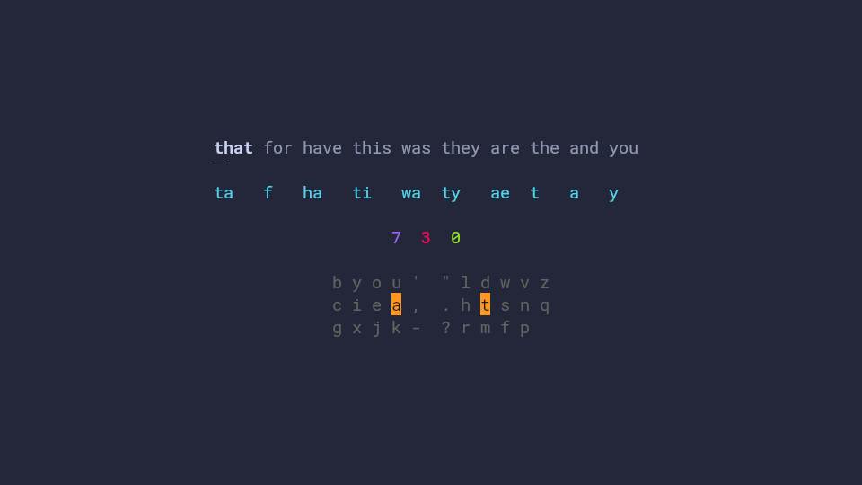

# Chordgen

Helps you to turn any keyboard into a chording-enabled device, and
generates chords that are optimised for your specific layout.

It supports standard keyboards and directional ones such as [Harite](https://github.com/dlip/harite-v3), [CharaChorder](https://www.charachorder.com) and [Svalboard](https://svalboard.com)

There is also a training mode with a full spaced-repetition implementation to help with memorizing chords



## Documentation

Full docs live at **<https://dlip.github.io/chordgen/>**

## Quickstart

```sh
pip install chordgen
chordgen setup     # downloads SUBTLEX-US, writes ~/.config/chordgen/{config.yaml, chords.csv}
chordgen gen       # picks an optimal chord per word and fills in alts
chordgen output    # writes firmware files for qmk / zmk / kanata / charachorder + training.txt
chordgen train     # interactive TUI to drill chords with spaced repetition
chordgen drill     # speed-drill TUI for chords you have already learned
```

Edit `~/.config/chordgen/chords.csv` (remove words you don't want, pin
chords by hand, etc.) and re-run `gen` whenever you want to refresh.

## Development

### Clone the repo

```sh
git clone https://github.com/dlip/chordgen.git
cd chordgen
```

### Nix

- Install [Nix](https://nixos.org/download/) or use NixOS.
- Add `devenv` to your packages.
- Run `devenv shell` or use the
  [shell hook](https://devenv.sh/auto-activation/).

### Non-nix

- Install [Python 3.11.14](https://www.python.org/downloads/release/python-31114/).
- Install `uv`:

  ```sh
  pip install uv
  ```

### Running

```sh
uv run chordgen --help
```

### Tests

```sh
uv sync --extra dev
uv run pytest
```

### Docs

The site is built with [MkDocs Material](https://squidfunk.github.io/mkdocs-material/):

```sh
uv sync --extra docs
uv run mkdocs serve     # live preview at http://localhost:8000
uv run mkdocs build     # build to ./site
```

The site is published to GitHub Pages from the `main` branch via
[`.github/workflows/docs.yml`](./.github/workflows/docs.yml).
