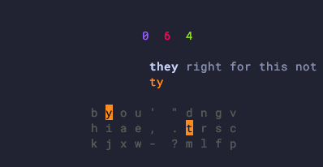

# chordgen

**Turn any keyboard into a chording-enabled device** — and learn the
chords with built-in spaced repetition.

We type letter by letter, which is slow and error-prone. Stenographers
type 300+ wpm by chording (pressing several keys at once for a whole
word) but the learning curve is brutal. **chordgen splits the
difference**: it picks an optimal chord for each word in your
vocabulary, generates firmware files for your keyboard, and trains
you on the chords with a spaced-repetition TUI.

It supports standard keyboards and directional ones such as
[Harite](https://github.com/dlip/harite-v3),
[CharaChorder](https://www.charachorder.com), and
[Svalboard](https://svalboard.com).



## Highlights

- **Optimised per layout.** Chord scoring takes your specific
  keyboard geometry into account.
- **Inflection-aware.** Each base word's chord automatically covers
  its plural / past-tense / `-ing` form via alt-slot modifiers.
- **Spaced-repetition learning.** `chordgen learn` graduates chords
  using FSRS so you only review what you're about to forget.
- **Real-text drilling.** `chordgen drill` is a speed test for words
  you've already learned, and `chordgen book` lets you practise on
  arbitrary prose.
- **Firmware export.** Writes ready-to-flash files for QMK, ZMK,
  Kanata, and CharaChorder, plus a training file for typing tutors.

## Quickstart

```sh
pip install chordgen
chordgen setup     # downloads SUBTLEX-US, writes ~/.config/chordgen/
chordgen gen       # picks an optimal chord per word and fills in alts
chordgen output    # writes firmware files + training.txt
chordgen learn     # interactive spaced-repetition TUI
chordgen drill     # speed-drill TUI for chords you've already learned
chordgen book      # practise on long-form prose
```

Edit `~/.config/chordgen/chords.csv` (remove words you don't want,
pin chords by hand, etc.) and re-run `gen` whenever you want to
refresh.

## Documentation

Full docs live at **<https://dlip.github.io/chordgen/>** — including
the [chording approach](https://dlip.github.io/chordgen/concepts/chording/),
the [`chords.csv` reference](https://dlip.github.io/chordgen/concepts/chords-csv/),
[output formats](https://dlip.github.io/chordgen/output-formats/qmk/),
the [config schema](https://dlip.github.io/chordgen/schema/), and the
[development guide](https://dlip.github.io/chordgen/development/).
